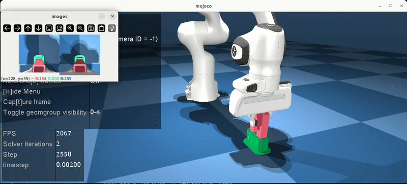
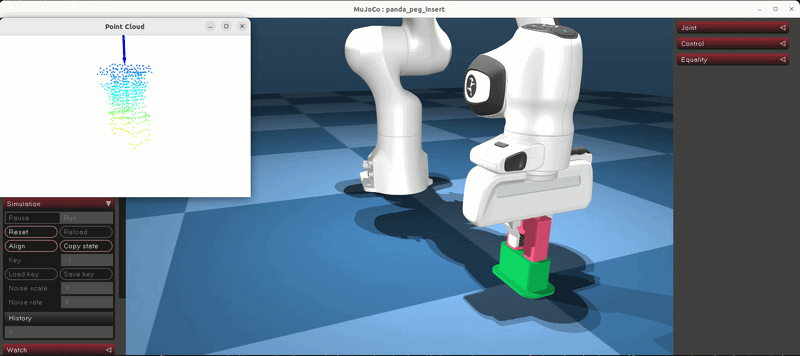

# SERL-Plus-Plus


> This repository is built upon a fork of [HIL-SERL](https://github.com/rail-berkeley/hil-serl).

## Requirements

- Python 3.10
- CUDA 12.4+ (recommended for GPU acceleration)
- PyTorch 2.4.1+
- MuJoCo 2.3.7+
- See `pyproject.toml` for full dependency list

## Installation

```bash
# clone repo
git clone <repository-url>
# cd folder
cd serl-torch
# create venv by uv
uv sync
# source venv
source .venv/bin/activate
```

## Quick Start
### 1. Peg insert sim with RGB



```bash
# cd peg_insert_sim
cd demos/experiments/peg_insert_sim
# Download demo data
mkdir demo_data && cd demo_data
wget https://github.com/liusong-0086/serl-plus-plus/releases/download/demo_data/peg_insert_sim_20_demos.pkl
cd ..
# Start learner node
bash run_learner.sh
# Open new terminal, start actor node
bash run_actor.sh
```

### 2. Peg insert sim with PointCloud



```bash
# cd peg_insert_sim
cd demos/experiments/peg_insert_sim
# Download demo data
mkdir demo_data && cd demo_data
wget https://github.com/liusong-0086/serl-plus-plus/releases/download/demo_data/peg_insert_pointcloud_sim_20_demos.pkl
cd ..
# Start learner node
bash run_learner.sh
# Open new terminal, start actor node
bash run_actor.sh
```